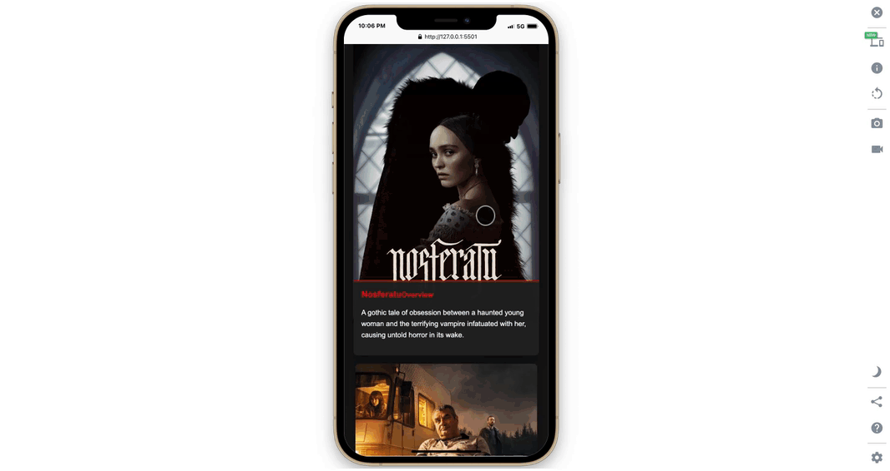

🚀 Project Features

    •	Movie Search and Filtering Feature in MOBILE:

    •	Movie Search and Filtering: Easily search for movies by name, genre, or release year.
    •	Dynamic Content Updates: Content updates instantly without page reloads.
    •	Add to Favorites: Save your favorite movies for quick access.
    •	Responsive Design: Optimized for mobile, tablet, and desktop devices.
    •	Modern Animations: Sleek CSS animations and JavaScript transitions.

📂 Project Structure

    •	index.html: Main page structure.
    •	style.css: All styling and visual designs.
    •	app.js: Dynamic content and user interactions.

🛠️ Technologies Used

    •	HTML5
    •	CSS3 (Flexbox, Animations)
    •	Vanilla JavaScript

🎥 Screenshots and GIFs

    •	Homepage:

Add a screenshot or GIF of the homepage here:
